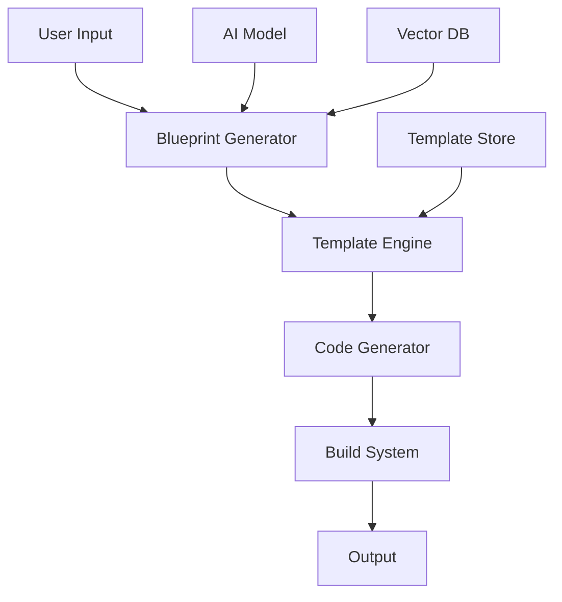

# Core Architecture Specification

## Technology Stack Specifications

### 1. Frontend Stack (Generated Applications)

#### Next.js Application
- **Framework**: Next.js 14.0.3
- **Runtime**: Node.js 20.9.0 LTS
- **Language**: TypeScript 5.2.2
- **Key Dependencies**:
  ```json
  {
    "dependencies": {
      "next": "14.0.3",
      "react": "18.2.0",
      "react-dom": "18.2.0",
      "typescript": "5.2.2",
      "@tanstack/react-query": "5.8.4",
      "@reduxjs/toolkit": "1.9.7",
      "tailwindcss": "3.3.5",
      "postcss": "8.4.31",
      "autoprefixer": "10.4.16",
      "zod": "3.22.4"
    },
    "devDependencies": {
      "@types/react": "18.2.37",
      "@types/node": "20.9.0",
      "@typescript-eslint/eslint-plugin": "6.11.0",
      "@typescript-eslint/parser": "6.11.0",
      "eslint": "8.53.0",
      "eslint-config-next": "14.0.3",
      "prettier": "3.1.0",
      "jest": "29.7.0",
      "@testing-library/react": "14.1.0",
      "@testing-library/jest-dom": "6.1.4"
    }
  }
  ```

#### Core Frontend Interfaces

```typescript
// Application Configuration
interface AppConfig {
  readonly APP_NAME: string;
  readonly API_BASE_URL: string;
  readonly AUTH_PROVIDER: 'jwt' | 'oauth2' | 'cognito';
  readonly ENVIRONMENT: 'development' | 'staging' | 'production';
  readonly FEATURE_FLAGS: Record<string, boolean>;
}

// API Client Configuration
interface ApiClientConfig {
  baseURL: string;
  timeout: number;
  headers: Record<string, string>;
  interceptors: {
    request: RequestInterceptor[];
    response: ResponseInterceptor[];
  };
}

// State Management
interface AppState {
  auth: AuthState;
  ui: UIState;
  data: DataState;
  errors: ErrorState;
}

// Core Component Props
interface BaseComponentProps {
  className?: string;
  testId?: string;
  children?: React.ReactNode;
}
```

### 2. Backend Stack (Generated Applications)

#### Node.js Server
- **Runtime**: Node.js 20.9.0 LTS
- **Framework**: Express 4.18.2
- **Key Dependencies**:
  ```json
  {
    "dependencies": {
      "express": "4.18.2",
      "typescript": "5.2.2",
      "@prisma/client": "5.5.2",
      "jsonwebtoken": "9.0.2",
      "bcryptjs": "2.4.3",
      "zod": "3.22.4",
      "winston": "3.11.0",
      "cors": "2.8.5",
      "helmet": "7.1.0",
      "compression": "1.7.4"
    },
    "devDependencies": {
      "@types/express": "4.17.21",
      "@types/node": "20.9.0",
      "prisma": "5.5.2",
      "jest": "29.7.0",
      "@types/jest": "29.5.8",
      "supertest": "6.3.3",
      "@types/supertest": "2.0.16"
    }
  }
  ```

#### Core Backend Interfaces

```typescript
// Server Configuration
interface ServerConfig {
  readonly PORT: number;
  readonly NODE_ENV: 'development' | 'staging' | 'production';
  readonly DATABASE_URL: string;
  readonly JWT_SECRET: string;
  readonly CORS_ORIGIN: string | string[];
  readonly RATE_LIMIT: {
    windowMs: number;
    max: number;
  };
}

// Middleware Configuration
interface MiddlewareConfig {
  cors: cors.CorsOptions;
  helmet: helmet.HelmetOptions;
  compression: compression.CompressionOptions;
  rateLimit: rateLimit.Options;
}

// Error Handling
interface AppError extends Error {
  statusCode: number;
  status: 'error' | 'fail';
  isOperational: boolean;
}

// Database Models
interface BaseModel {
  id: string;
  createdAt: Date;
  updatedAt: Date;
}
```

### 3. Generator Platform Stack

#### Core Generator Components
- **Language**: TypeScript 5.2.2
- **AI Integration**: OpenAI API v4
- **Vector Database**: Weaviate 1.21.3
- **Key Dependencies**:
  ```json
  {
    "dependencies": {
      "openai": "4.17.4",
      "weaviate-ts-client": "1.5.0",
      "handlebars": "4.7.8",
      "chalk": "5.3.0",
      "commander": "11.1.0",
      "inquirer": "9.2.12",
      "ora": "7.0.1"
    }
  }
  ```

#### Generator Interfaces

```typescript
// Blueprint Configuration
interface BlueprintConfig {
  projectName: string;
  description: string;
  features: Feature[];
  architecture: ArchitectureConfig;
  deployment: DeploymentConfig;
}

// AI Model Configuration
interface AIModelConfig {
  provider: 'anthropic';
  model: 'claude-3-sonnet-20240229';
  temperature: number;
  maxTokens: number;
  topP: number;
  frequencyPenalty: number;
  presencePenalty: number;
}

// Template Engine Configuration
interface TemplateConfig {
  engine: 'handlebars';
  helpers: Record<string, HandlebarsTemplateDelegate>;
  partials: Record<string, string>;
  hooks: {
    beforeRender?: (template: string) => Promise<string>;
    afterRender?: (result: string) => Promise<string>;
  };
}
```

## System Architecture

### 1. Component Interaction Diagram



### 2. Data Flow Specifications

```typescript
// Data Flow Interfaces
interface DataFlow {
  input: UserInput;
  blueprint: Blueprint;
  template: Template;
  generatedCode: GeneratedCode;
  buildOutput: BuildOutput;
}

interface DataTransformation {
  validateInput: (input: UserInput) => Promise<ValidationResult>;
  generateBlueprint: (input: ValidatedInput) => Promise<Blueprint>;
  renderTemplate: (blueprint: Blueprint) => Promise<GeneratedCode>;
  build: (code: GeneratedCode) => Promise<BuildOutput>;
}
```

## Security Requirements

### 1. Authentication & Authorization

```typescript
interface SecurityConfig {
  auth: {
    jwt: {
      secret: string;
      expiresIn: string;
      algorithm: 'HS256' | 'RS256';
    };
    passwordHash: {
      saltRounds: number;
      algorithm: 'bcrypt';
    };
  };
  rateLimit: {
    windowMs: number;
    max: number;
  };
}
```

### 2. Data Protection

- **Encryption**: AES-256-GCM for sensitive data
- **Key Management**: AWS KMS or equivalent
- **Data Sanitization**: Input validation using Zod schemas

## Performance Requirements

### 1. Response Time Targets

```typescript
interface PerformanceTargets {
  generation: {
    blueprintGeneration: 5000; // ms
    templateRendering: 2000; // ms
    codeGeneration: 10000; // ms
  };
  api: {
    p95LatencyTarget: 200; // ms
    p99LatencyTarget: 500; // ms
  };
}
```

### 2. Resource Utilization

```typescript
interface ResourceLimits {
  memory: {
    maxHeapSize: '2GB';
    gcThreshold: '1.5GB';
  };
  cpu: {
    maxThreads: 4;
    workerCount: 2;
  };
  storage: {
    tempSpace: '5GB';
    outputLimit: '1GB';
  };
}
```

## Testing Requirements

### 1. Coverage Thresholds

```typescript
interface CoverageThresholds {
  statements: 85;
  branches: 80;
  functions: 90;
  lines: 85;
}
```

### 2. Test Specifications

```typescript
interface TestRequirements {
  unit: {
    framework: 'jest';
    coverage: CoverageThresholds;
    timeout: 5000; // ms
  };
  integration: {
    framework: 'jest';
    coverage: CoverageThresholds;
    timeout: 10000; // ms
  };
  e2e: {
    framework: 'cypress';
    coverage: CoverageThresholds;
    timeout: 30000; // ms
  };
}
```

## Error Handling

### 1. Error Categories

```typescript
enum ErrorCategory {
  VALIDATION_ERROR = 'VALIDATION_ERROR',
  GENERATION_ERROR = 'GENERATION_ERROR',
  TEMPLATE_ERROR = 'TEMPLATE_ERROR',
  BUILD_ERROR = 'BUILD_ERROR',
  RUNTIME_ERROR = 'RUNTIME_ERROR'
}

interface ErrorDefinition {
  category: ErrorCategory;
  code: string;
  httpStatus: number;
  message: string;
  isOperational: boolean;
}
```

### 2. Recovery Procedures

```typescript
interface RecoveryProcedure {
  error: ErrorDefinition;
  steps: RecoveryStep[];
  fallback: FallbackAction;
  notification: NotificationConfig;
}
```

## Monitoring and Logging

### 1. Metrics Collection

```typescript
interface MetricsConfig {
  collection: {
    interval: number; // ms
    retention: number; // days
  };
  alerts: {
    thresholds: Record<string, number>;
    channels: NotificationChannel[];
  };
}
```

### 2. Logging Configuration

```typescript
interface LogConfig {
  level: 'debug' | 'info' | 'warn' | 'error';
  format: 'json' | 'text';
  destination: 'file' | 'stdout' | 'service';
  rotation: {
    maxSize: string;
    maxFiles: number;
  };
}
```

## Implementation Notes

1. All components must implement the interfaces defined in this specification
2. Version numbers must be strictly followed for compatibility
3. Security requirements are non-negotiable
4. Performance targets must be met in production environments
5. Test coverage thresholds must be maintained

## Version History

- 1.0.0: Initial specification
- 1.0.1: Added detailed interface definitions
- 1.0.2: Updated security requirements 